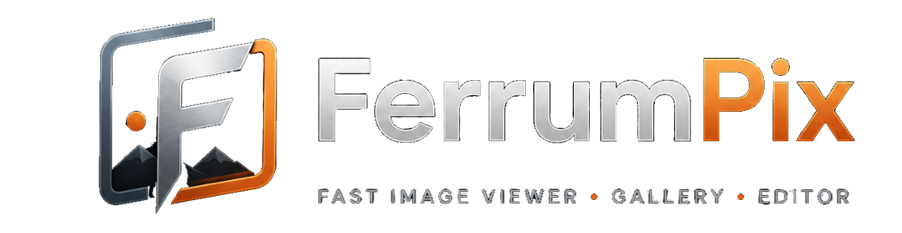
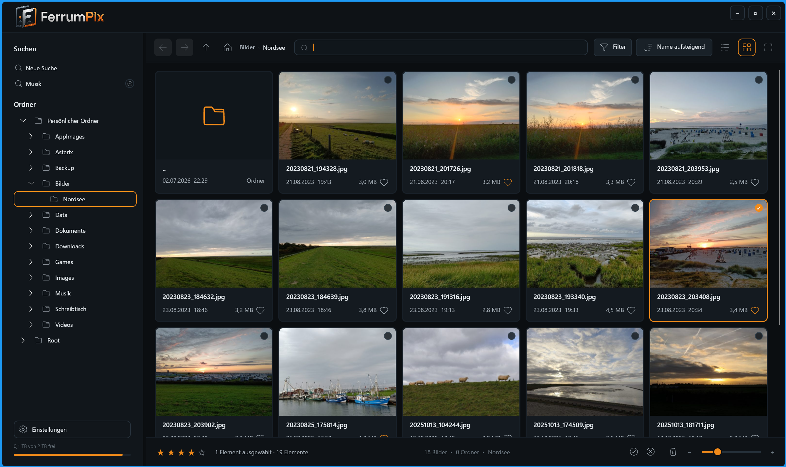
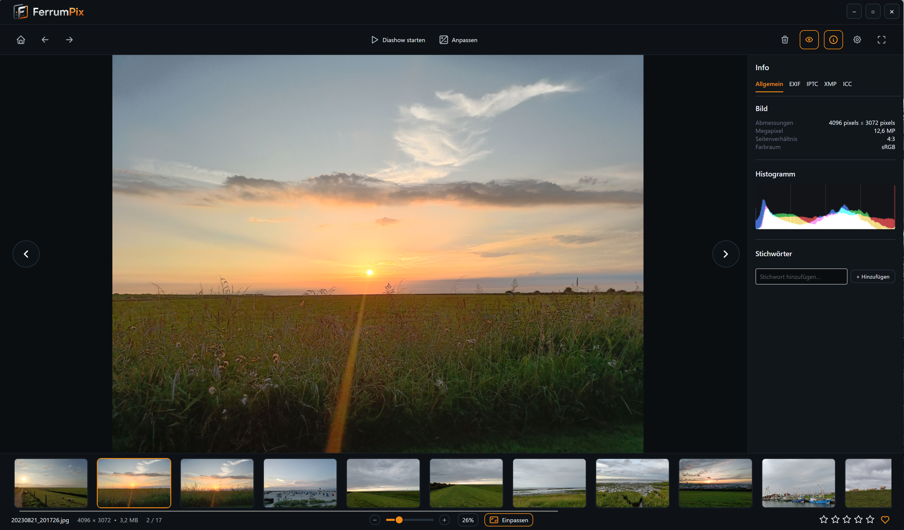
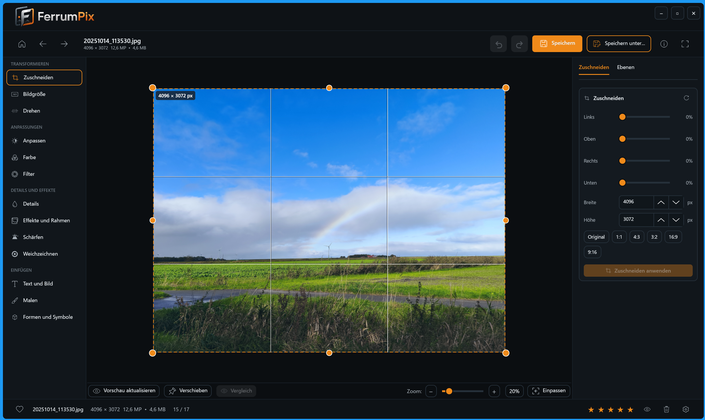
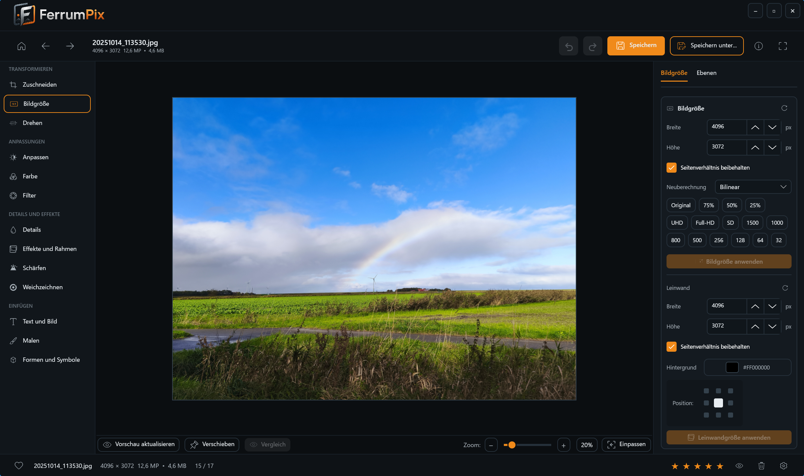
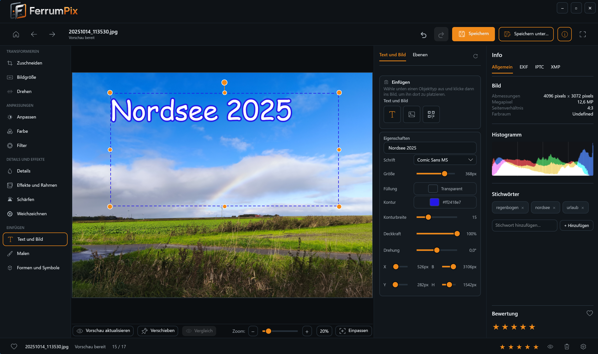
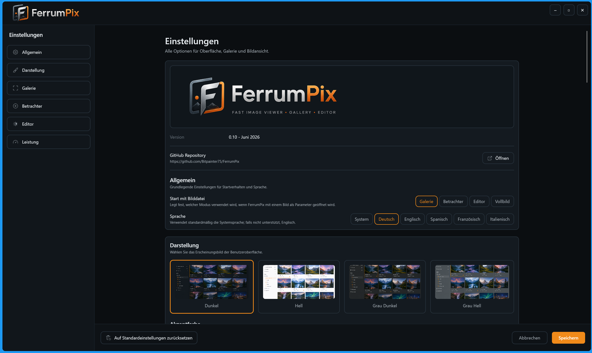

# FerrumPix

FerrumPix is a desktop photo management and editing application for Linux and Windows, built with [Avalonia UI](https://avaloniaui.net/) and VB.NET.

> **Status:** Actively in development. Further details will follow once the project reaches a suitable maturity level.

## Features



**Gallery**
- Folder-tree navigation (multiple drives on Windows), grid/list view, sorting, thumbnail caching; the folder tree auto-scrolls the selected entry into view, centered when possible
- Ratings (stars), favorites, tags, saved searches shown as a navigable tree (filters: favorite, rating, file type incl. RAW/non-RAW, subfolders)
- Extended search: combine text terms with AND/OR (e.g. `urlaub OR strand`, quoted phrases for multi-word terms), plus structured conditions on image data and EXIF (width/height, camera, ISO, aperture, focal length, date taken), combinable with a single AND/OR switch; EXIF/dimensions are read and cached on first use if not yet known
- File operations: copy/cut/paste, rename/batch rename, duplicate, create folder, delete (with confirmation), export selected, batch selection, reveal in file manager, copy path
- Batch rename: pattern-based with counters (`#`, `###`), and placeholders for the original name/extension, file date, EXIF date taken, image width/height, camera, ISO, aperture, and focal length; the last-used pattern is remembered between sessions
- Batch format conversion: convert selected images to JPG/PNG/WEBP (with quality setting) in place, skipping files already in the target format and auto-numbering on name collisions
- Collage creation: Grid, Hero (one large image + the others framing it — top/bottom/left/right/center, position pickable via the same anchor-grid as the editor's canvas tool, or by clicking the desired image in the live preview), and Random (jittered size/rotation per photo) layouts; adjustable width/columns/margin, a per-image border, background color/format/quality, a zoomable/pannable preview with a fit button, and a reshuffle button that randomizes image order (and, in Random mode, size/rotation) across all three layouts
- Camera RAW support (CR2, CR3, NEF, ARW, DNG, PEF, RW2) alongside standard formats
- SQLite-backed library (metadata, ratings, tags, cached EXIF/dimensions for search)
- EXIF display (via MetadataExtractor)
- Video files (MP4, MOV, MKV, AVI, WebM, M4V) show a poster-frame thumbnail with a play badge



**Viewer**
- Fullscreen view with fast switching between images, zoom/pan, rotate/flip
- Slideshow with configurable interval, filmstrip navigation
- Inline video playback (play/pause, seek, mute) in both windowed and fullscreen mode
- Rate, favorite, tag, and delete images directly from the viewer; jump straight into the editor
- Info sidebar with General/EXIF/IPTC/XMP tabs and a live histogram





**Editor** (non-destructive, with undo/redo)
- Crop (with presets), resize, rotate/straighten (with auto canvas expand), flip, canvas resize with anchor picker
- Adjust: exposure, brightness, contrast, highlights/shadows, whites/blacks, tone curve (RGB + individual channels)
- Color: white balance, temperature/tint, vibrance/saturation, and an 8-band HSL color mixer — pick a color band on a color wheel, then dial in its hue/saturation with a shared pair of sliders
- Filters: 15 presets (B&W, Warm, Cool, Fade, Contrast, Sepia, Matte, Cross, Dramatic, Soft, Noir, Duotone, Polaroid, VHS, …) with a strength slider
- Details: clarity, sharpening, noise reduction (Gaussian/median)
- Effects/Frame: vignette, grain, border with color picker
- Paint tool: brush, eraser, and a blur/retouch brush, each with size/hardness/opacity
- Rectangle selection tool: drag a selection on the image, then copy it into a new movable object (also via Ctrl+C/Ctrl+V, repeatable paste) or fill it with a solid color or linear/radial gradient (gradient direction/invert supported)
- Insert objects: text, watermark, shapes (rectangle, ellipse, square, triangle, cone, pyramid, trapezoid, diamond, spiral, droplet, speech bubble, line, arrow), symbols, images, and QR codes
- Per-object properties: fill (solid or gradient) and stroke color/width, opacity, rotation, position/size, plus drop shadow and glow effects (color, offset, blur, strength) — edited live directly on the canvas or via the sliders
- Objects panel: reorder (front/back), duplicate, show/hide, delete, drag-handles for move/resize/rotate on canvas
- Central color picker (color wheel, hex input, recent colors) with a built-in eyedropper to sample any color straight from the image
- Before/after comparison slider, save/load non-destructive edit recipes



**Settings**
- Theme (light/dark/darkgrey/lightgrey) and accent color
- Language: auto-detect, German, English, Spanish, French, Italian
- Thumbnail size/quality, JPEG export quality, filmstrip visibility, and other per-view preferences
- UI scale, video hardware acceleration toggle, transparency background (checkerboard or solid color), startup folder/image behavior, hidden folders/breadcrumbs
- Thumbnail cache management: size limit, per-folder or full cache cleanup, database cleanup
- Window position/size and last-used folder are remembered between sessions



## Technology Stack

- [Avalonia UI](https://avaloniaui.net/) 11.3 (Fluent theme) — cross-platform UI framework
- VB.NET on .NET 10
- [ReactiveUI](https://www.reactiveui.net/) for MVVM
- [SkiaSharp](https://github.com/mono/SkiaSharp) for image processing/rendering
- [Microsoft.Data.Sqlite](https://learn.microsoft.com/dotnet/standard/data/sqlite/) for the library
- [MetadataExtractor](https://github.com/drewnoakes/metadata-extractor-dotnet) for EXIF data
- [QRCoder](https://github.com/codebude/QRCoder) for QR code objects
- [LibVLCSharp](https://code.videolan.org/videolan/LibVLCSharp) for video thumbnail extraction and playback

## Installation

All packages are self-contained — they bundle the .NET runtime, so no separate .NET installation is required to run them.

> **Video playback on Linux:** requires VLC (or at least `libvlc`) to be installed system-wide, e.g. `sudo apt install vlc` or `sudo pacman -S vlc` — it cannot be bundled into the AppImage/Flatpak the same way the Windows build bundles it. Without it, FerrumPix still runs normally; video files just won't show a thumbnail or play.


## Building from Source

Compiling the project (as opposed to just running a pre-built package) requires the [.NET SDK 10](https://dotnet.microsoft.com/) or newer.

```bash
dotnet build FerrumPix.vbproj
dotnet run --project FerrumPix.vbproj
```

## License

[GPL-3.0](LICENSE)
