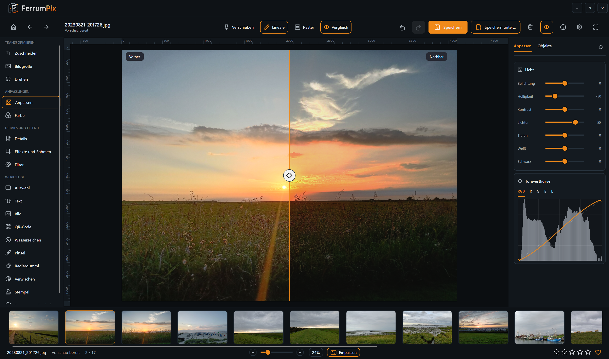

# FerrumPix

FerrumPix is a desktop photo manager and image editor for Linux and Windows. It is built with [Avalonia UI](https://avaloniaui.net/) and VB.NET.

Project website: [FerrumPix.app](https://ferrumpix.app/)

FerrumPix is in active development. The gallery, viewer, editor, settings and Immich integration are already usable. Current work focuses on stability, performance, workflow polish and cleanup.

## What FerrumPix Does

- Browse local photo folders with thumbnails, ratings, favorites, tags and saved searches.
- View photos fullscreen with zoom, pan, filmstrip navigation, metadata and histogram.
- Edit photos with crop, resize, rotate, color tools, tone curves, filters, text, shapes, symbols, retouch tools, paint tools and selections.
- Run batch work from the gallery, including rename, convert, resize, watermark, metadata removal and filters.
- Work with common image and video formats.
- Connect to a self-hosted Immich server for browsing, upload, download, editing and metadata sync.

## Gallery


The gallery is built for daily photo work. It supports folder browsing, fast thumbnails, file operations, ratings, favorites, tags and saved searches.

Search can combine normal text with metadata such as camera, ISO, aperture, focal length, date taken and image size. Batch tools are available from the context menu and from the footer menu.

## Viewer


The viewer opens photos quickly and keeps navigation simple. It supports fullscreen mode, zoom, pan, slideshow, filmstrip navigation, ratings, favorites, tags and deletion.

Video files can show thumbnails and play inline when the needed video support is available on the system.

## Editor



The editor covers the most common photo work:

- Crop, resize, rotate, flip and canvas resize.
- Exposure, brightness, contrast, highlights, shadows, tone curves and white balance.
- Color tools with HSL, vibrance, saturation and split toning.
- Filters, LUT files and Lightroom `.xmp` preset import.
- Film negative conversion for scanned negatives.
- Text, shapes, symbols, images, QR codes and watermarks.
- Brush, transparent eraser, blur/smudge, clone stamp and repair brush tools.
- Rectangle, ellipse, lasso and magic wand selections.
- Per object editing with opacity, blend modes, shadows, glow and transform controls.

The editor is not non-destructive after saving. While the editor is open, changes can be undone and objects stay editable. Saving writes the result into pixels. Use *Save as* if the original file should stay untouched.


## Immich Integration

FerrumPix can connect directly to a self-hosted [Immich](https://immich.app/) server.

Supported Immich work includes:

- Browse all photos and albums.
- View albums with the full album in the filmstrip.
- Upload local photos and videos.
- Download Immich originals to local folders.
- Sync ratings, favorites and keywords.
- Search Immich from saved search lists.
- Edit Immich photos and save the result as a new asset.
- Optionally update existing Immich assets in place.
- Optionally delete Immich photos and albums when this is enabled in Settings.

## Settings


Settings cover theme, accent color, language, thumbnail quality, export quality, metadata handling, video support, UI scale, font scale, cache cleanup and Immich connection details.

## Technology

- [Avalonia UI](https://avaloniaui.net/) 12.1
- VB.NET on .NET 10
- [ReactiveUI](https://www.reactiveui.net/)
- [SkiaSharp](https://github.com/mono/SkiaSharp)
- [Svg.Skia](https://github.com/wieslawsoltes/Svg.Skia)
- [Microsoft.Data.Sqlite](https://learn.microsoft.com/dotnet/standard/data/sqlite/)
- [MetadataExtractor](https://github.com/drewnoakes/metadata-extractor-dotnet)
- [QRCoder](https://github.com/codebude/QRCoder)
- [LibVLCSharp](https://code.videolan.org/videolan/LibVLCSharp)
- [Tabler Icons](https://github.com/tabler/tabler-icons)

## Installation

Release packaging currently targets Linux and Windows:

- Linux AppImage
- Windows Setup
- Portable Linux ZIP
- Portable Windows ZIP

And as a package in the AUR 
- https://aur.archlinux.org/packages/ferrumpix-bin


The packages are self-contained and include the .NET runtime.

Video playback on Linux needs VLC or `libvlc` installed on the system. Without it, FerrumPix still runs, but video thumbnails and playback are not available.

## Building From Source

Building FerrumPix requires the [.NET SDK 10](https://dotnet.microsoft.com/) or newer.

```bash
dotnet build FerrumPix.sln
dotnet run --project FerrumPix.vbproj
```

## License

[GPL-3.0](LICENSE)
