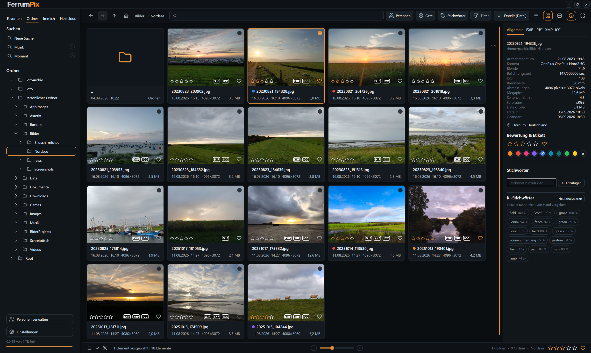
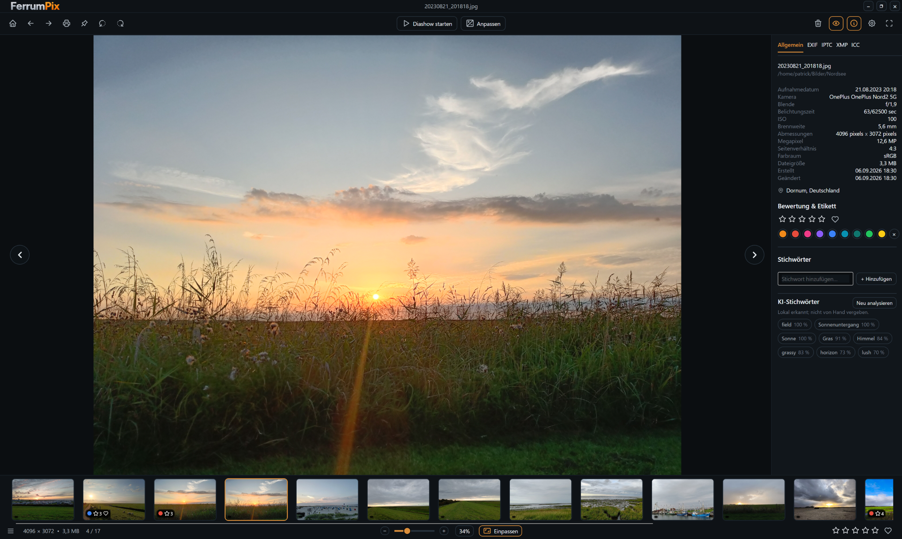
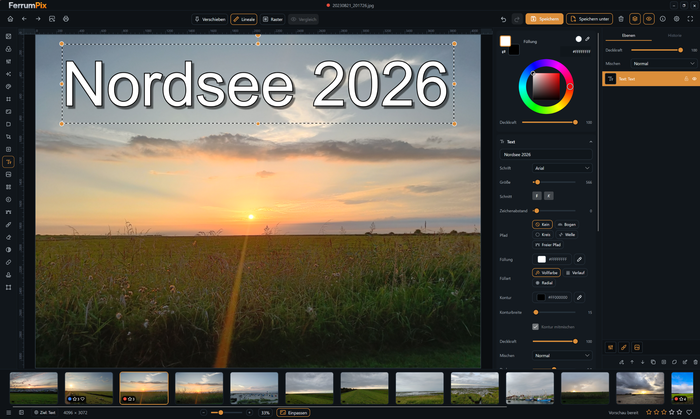
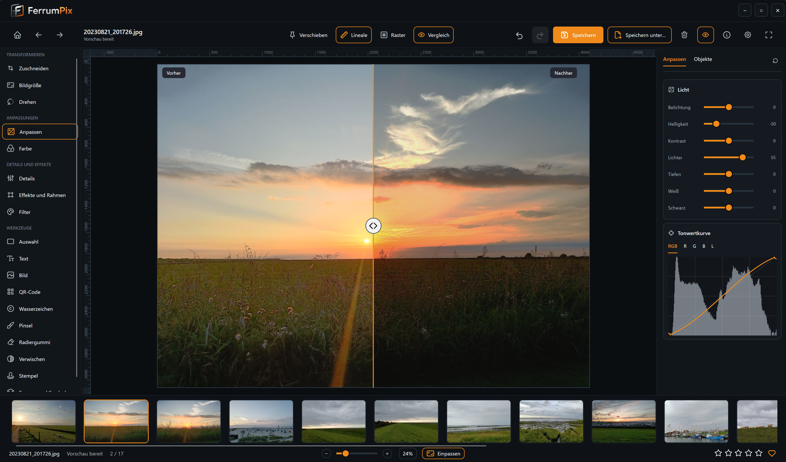

# FerrumPix

FerrumPix is a desktop photo manager and image editor for Linux and Windows, with experimental ARM64 and macOS builds. Browse your folders, sort and rate what is in them, look at photos properly, and edit them - all in one application, all on your own machine. It can also connect to a self-hosted [Immich](https://immich.app/) or [Nextcloud](https://nextcloud.com/) server.

It is built with [Avalonia UI](https://avaloniaui.net/) and .NET 10, in VB.NET, which I still love even though it is rare nowadays. This started as a private project - an application built exactly the way I always wanted one to look and work - and it is free and open source for anyone who finds it useful.

To be transparent: yes, I use AI to support my development workflow. However, it still requires a massive amount of manual work, architecture planning, and debugging. I am currently investing a lot of time. A ton of passion, unique ideas, and genuine hard work went into this project.

FerrumPix is in active development. The gallery, viewer, editor, settings and Immich integration are already usable. Current work focuses on stability, performance, workflow polish and cleanup.

Project website: [FerrumPix.app](https://ferrumpix.app/)

## What you can do with it

- Browse local photo folders with fast thumbnails, ratings, favourites, keywords and saved searches.
- View photos and videos fullscreen, compare two side by side, and check metadata and histogram.
- Edit: crop, resize, rotate and distort, exposure and colour, curves, filters, masks, retouching, text and shapes, layers.
- Develop RAW files from the sensor data, with lens correction from measured data for some 1300 lenses.
- Run batch work over a whole selection: rename, convert, resize, watermark, filters, metadata, export.
- Open JPEG, PNG, WEBP, BMP, GIF and RAW, plus HEIC/HEIF/AVIF and TIFF read-only, and Photoshop files with their layers.
- Find the people in your photos and search by them, and search by where a photo was taken - both entirely on your own machine.
- Connect to your own Immich or Nextcloud server for browsing, upload, download, editing and metadata sync.

Your originals are never changed behind your back: edits to RAW and Photoshop files live in a small sidecar next to the file, and everything else is only written when you save.

## Gallery



Folder tree, grid and list view, fast thumbnails, file operations, ratings, favourites, keywords and saved searches. Search combines plain text with metadata such as camera, ISO, aperture, focal length, date taken and image size.

Ratings, colour labels and keywords are read from the sidecars Lightroom, darktable or digiKam write, so a collection you tagged elsewhere arrives with its work intact.

Name the folders your photos live in and FerrumPix reads them in the background, subfolders included, so search and filters cover your whole collection instead of only the folders you happened to open. It runs shortly after startup if you want it to, and it can be stopped at any time. Later runs only look at what has changed, and nothing is ever written next to your photos.

One list in the settings shows every folder FerrumPix knows, grouped under the ones you watch. Search it, then clean up the catalogue data or the thumbnails of whatever the search leaves, or send the people search over them - on a whole tree or on a single folder.

An info panel shows the selected picture with its shot data, histogram, rating, label and keywords; with several selected it shows what they have in common and lets you set them all at once.

Photos can be filtered by keyword, by person and by where they were taken, alone or in combination. FerrumPix finds the people in your photos, groups them, and you give each group its name; the names are stored beside the picture, so they stay with the photos. A people area of its own shows a wall of faces for sorting out a library that grew over years.

Photos without a location can be given one: type a coordinate or just a town name, or copy the place from a picture that already has it and paste it onto the rest. JPEG files carry it inside the file, everything else in a sidecar next to the original. The town search runs on your own machine.

Batch work runs over a whole selection: rename, convert, resize, watermark, filters, metadata removal, and *Export to* for putting a name pattern, a look, a size and a target format into one run, locally or straight to Immich. Photos can also be printed, laid out as contact sheets or combined into a collage, each showing your edits.

## Viewer



Fullscreen viewing with zoom, pan, slideshow, filmstrip navigation, rating, tagging and deleting, and an info panel with EXIF, IPTC, XMP, ICC and a live histogram. Videos play inline.

Two photos can be put side by side for comparison, sharing one zoom so you always see the same part of both. Pin one of them and page through the rest against it, rating and deleting as you go, which is the quick way to cull a series. RAW files are developed here rather than shown as the camera's embedded preview.

## Editor



**Geometry.** Crop, resize, rotate, flip and canvas size, plus four ways to distort a picture: perspective, a line you lay on an edge and drag, a grid, and a frame whose edges you bend. None of them is computed into the pixels, so they can be adjusted or taken off at any time, and with an object selected they distort that object instead.

**Light and colour.** Exposure, contrast, highlights, shadows, black and white point, white balance, tone curves, HSL, vibrance and saturation, colour grading with four colour wheels, and camera calibration. *Auto* sets a sensible starting point, and a set of slider values can be saved and put on any other photo.

**Details and effects.** Clarity, structure, dust and scratches, sharpening, softening and three kinds of noise reduction. *Depth blur* takes its strength from how far away each point is, so lights in the background open into bright discs. Vignette, grain and frame sit in a separate *Effects* tool, where the grain can also be coloured: a slider lets the three colour channels drift apart, from plain grey grain to the coloured speckles of a fast film.

**Masks and selections.** Rectangle, ellipse, lasso and magic wand selections, a soft-edged mask brush, and graduated and radial masks you drag onto the picture. One mask can be built from several parts, each added, subtracted or intersected and changeable afterwards, and any of them becomes a layer whose adjustment applies only inside it. A mask can be looked at on its own, switched off, or copied onto another layer.

**The pen.** Draw a curve point by point and change it at its points afterwards. One button turns it into a selection, so a cut-out stays correctable. A path draws nothing until you give it a stroke or a fill, and text can follow one.

**With a model file installed** (see below), four more things become available: clicking an object to select it, selecting by distance from the camera, removing something so the background is continued through the gap (on the photo or inside a marked layer), and denoising a photo with a model.

**Retouching and painting.** Brush, eraser, blur and smudge, clone stamp and repair brush, with thirteen brush variants. A selection keeps them inside it, and with a picture layer selected they work on that layer instead of on the photo. An empty layer to paint on is one click away in the layers panel, its transparent pixels can be locked so strokes stay inside what is already there, and CTRL-clicking a layer thumbnail loads its shape as a selection.

**Objects and layers.** Text, shapes, symbols, images, QR codes and watermarks, each with opacity, blend mode, shadow, glow and transform, and text that follows an arc, a circle or a wave. Any of them can carry a mask or be clipped to the layer below, and an adjustment placed above an object can be held to that object the same way. The layers panel holds the whole stack with visibility, order, grouping, merging and rasterizing, and layers can be copied and pasted, also from and to other programs. A group counts as one layer, with its own opacity, blend mode and mask, and groups can go inside groups.



**Filters and presets.** Filters, LUT files (`.cube`) and XMP presets as written by Lightroom and Camera Raw. All of them, and the slider sets you saved yourself, can also be applied to a whole selection at once.

**Saving.** Save as JPEG, PNG, WEBP, TIFF or PDF, as a Photoshop file with the layer stack intact, or as an `.fpx` project that keeps adjustments and layers editable when you open it again. `CTRL+P` prints what you see, edits included.

### RAW and other formats

RAW files are developed from the actual sensor data: a photo keeps the exposure it was taken with, colours land close to what other raw developers show, and coloured speckle is cleaned up along the way.

Lens defects are corrected from measured data covering some 1300 lenses: distortion, coloured fringes and the darkening towards the edges. Lens and camera are recognised from the shot data, and where there is nothing for your lens, nothing is changed.

Edits to a RAW go into a small sidecar next to it; the RAW itself is never modified. A Lightroom sidecar with develop settings is converted once, so a photo edited elsewhere opens the way you left it.

HEIC/HEIF/AVIF and TIFF open read-only. A Photoshop file (`.psd`/`.psb`) opens with its layers rather than as one flat picture and can be written back out, so it goes on to Photoshop, Affinity or GIMP; text can come in as text you keep typing on or as a picture. Layer masks, groups, 16-bit files and colour modes other than RGB are not covered.

### Model files

Seven features use an extra file: selecting an object by clicking it, working by distance, removing an object, denoising, enlarging with a model, finding the people in your photos, and turning coordinates into a place name. The settings have a *Models* section that fetches each file on request; where one is missing, the matching controls are simply not there. Finding people and naming places have to be switched on there as well.

Enlarging offers five models, from twice to four times, thorough or quick, one that keeps the grain and one for drawings. A switch in the same section lets the graphics card do the work, which finishes several times sooner with the same result.

Everything runs on your own machine - nothing is sent anywhere. The files come from [MobileSAM](https://github.com/ChaoningZhang/MobileSAM) (Apache-2.0), [MiDaS](https://github.com/isl-org/MiDaS) (MIT), [LaMa](https://github.com/advimman/lama) (Apache-2.0), [SCUNet](https://github.com/cszn/SCUNet) (Apache-2.0), [NAFNet](https://github.com/megvii-research/NAFNet) (MIT), [Real-ESRGAN](https://github.com/xinntao/Real-ESRGAN) (BSD-3-Clause), the [OpenCV Model Zoo](https://github.com/opencv/opencv_zoo) (MIT and Apache-2.0) and [GeoNames](https://www.geonames.org/) (CC BY 4.0), collected with their licences at [FerrumPix-Models](https://github.com/Bitpainter75/FerrumPix-Models). The one that compares faces is fetched straight from its publisher, the [ONNX Model Zoo](https://huggingface.co/onnxmodelzoo/arcfaceresnet100-8): its weights come from [InsightFace](https://github.com/deepinsight/insightface), which limits them to non-commercial research, so it is not passed on with the others.

## Immich

FerrumPix can connect directly to a self-hosted Immich server: browse all photos and albums, upload local files, download originals, sync ratings, favourites and keywords, search from saved search lists, and edit an Immich photo and save the result as a new asset. Updating or deleting existing assets is possible too, but has to be enabled in Settings.

The people your server recognised and the cities it knows appear in the same filter buttons as the local ones, under a heading of their own. Deleted photos are listed under Trash and can be put back from there.

FerrumPix authenticates with an API key. A key with `all` works; if you prefer a restricted one, build it up in layers - each missing permission disables exactly one function instead of breaking the integration:

**Read-only** - browse, view, download:

```
user.read  asset.read  asset.view  asset.download  album.read  person.read  tag.read
```

**Add for writing metadata** - ratings, favourites, description, keywords:

```
asset.update  tag.create  tag.asset
```

**Add for uploading** - upload from the gallery, and saving an edited photo as a new asset:

```
asset.upload  albumAsset.create  asset.copy
```

Plus `album.create` and `album.update` if FerrumPix should create and rename albums, and `asset.delete` with `album.delete` if *Allow deleting* is on.

*Update existing assets* replaces the file of an existing asset, and the permission for it is named differently across Immich versions. Left off, FerrumPix always creates a new asset instead.

## Nextcloud

A Nextcloud with the Memories app can be used as a second server: your timeline, albums, people, places and keywords appear as folders in the gallery, photos open in the viewer and the editor, and deleted ones are listed under Trash and can be put back from there.

Because Nextcloud keeps your photos as files, more is possible here than on an Immich server. A RAW on the server can be edited without touching it: saving puts the recipe in a sidecar file next to the original, and it is picked up again the next time you open the photo. If you would rather have the edit written into the file itself, *Replace originals on the server* does that - the file keeps its identity, its albums and its shares. RAW and PSD files are never overwritten either way.

Local pictures can be uploaded by dragging them onto a Nextcloud entry, by pasting, or from the right-click menu; they go to the folder set in Settings and an existing name is numbered rather than overwritten. Keywords, favourites and album assignments are written back to the server; stars and colour labels stay local, as Nextcloud does not know them.

FerrumPix signs in with your user name and an app password, which you create in Nextcloud under Settings, Security. Deleting on the server has to be enabled in Settings; deleted photos go to the Nextcloud trash, unless you also switch on *Delete for good*.

## Settings

Theme, accent colour, language, interface and font scale, thumbnail and export quality, metadata handling, video support, cache cleanup and the connection to an Immich or Nextcloud server.

Gallery and editor can be set up to match how you work: what a double-click opens, which tool the editor starts with, the order of the tool bar, a default format for saving, and which adjustment groups you want to see at all. Two switches concern RAW development, the base brightness per camera model and the lens correction.

Your version is at the top, with a link to the download page when a different one has been published. The last two sections are reference: all keyboard and mouse shortcuts, and everything FerrumPix is built on with a link to each licence.

## Installation

### Linux

| Package | For | Download |
|---|---|---|
| AppImage | Any distribution, runs without installing | [FerrumPix-x86_64.AppImage](https://github.com/Bitpainter75/FerrumPix/releases/download/latest/FerrumPix-x86_64.AppImage) |
| Flatpak | Any distribution with Flatpak, sandboxed | [FerrumPix.flatpak](https://github.com/Bitpainter75/FerrumPix/releases/download/latest/FerrumPix.flatpak) |
| DEB | Debian, Ubuntu, Mint (amd64) | [FerrumPix-amd64.deb](https://github.com/Bitpainter75/FerrumPix/releases/download/latest/FerrumPix-amd64.deb) |
| RPM | Fedora, openSUSE (x86_64) | [FerrumPix-x86_64.rpm](https://github.com/Bitpainter75/FerrumPix/releases/download/latest/FerrumPix-x86_64.rpm) |
| ZIP | Portable, unpack and run (x64) | [FerrumPix-linux-x64.zip](https://github.com/Bitpainter75/FerrumPix/releases/download/latest/FerrumPix-linux-x64.zip) |
| ZIP | Portable, unpack and run (ARM64) | [FerrumPix-linux-arm64.zip](https://github.com/Bitpainter75/FerrumPix/releases/download/latest/FerrumPix-linux-arm64.zip) |

On Arch and its derivatives there is [ferrumpix-bin](https://aur.archlinux.org/packages/ferrumpix-bin) in the AUR.

The AppImage carries update information, so tools that manage AppImages find new versions on their own.

### Windows

| Package | For | Download |
|---|---|---|
| Setup | Installs with start menu entry and file types (x64) | [FerrumPix-win-x64-Setup.exe](https://github.com/Bitpainter75/FerrumPix/releases/download/latest/FerrumPix-win-x64-Setup.exe) |
| ZIP | Portable, unpack and run (x64) | [FerrumPix-win-x64.zip](https://github.com/Bitpainter75/FerrumPix/releases/download/latest/FerrumPix-win-x64.zip) |
| ZIP | Portable, unpack and run (ARM64) | [FerrumPix-win-arm64.zip](https://github.com/Bitpainter75/FerrumPix/releases/download/latest/FerrumPix-win-arm64.zip) |

### macOS

| Package | For | Download |
|---|---|---|
| App bundle | Intel Macs | [FerrumPix-osx-x64-unsigned.app.zip](https://github.com/Bitpainter75/FerrumPix/releases/download/latest/FerrumPix-osx-x64-unsigned.app.zip) |
| App bundle | Apple Silicon | [FerrumPix-osx-arm64-unsigned.app.zip](https://github.com/Bitpainter75/FerrumPix/releases/download/latest/FerrumPix-osx-arm64-unsigned.app.zip) |

### Experimental

The ARM64 and macOS builds are untested. If you try one, please let me know whether it works.

The macOS builds are unsigned, so Gatekeeper may say the app is "damaged" or "can't be
opened". That does not mean the ZIP is broken. Please try this:

1. Download the right build: arm64 for Apple Silicon (M1, M2, M3, M4), x64 for Intel Macs.
2. Unzip it.
3. Move FerrumPix to Applications.
4. Open Terminal and run:

       xattr -dr com.apple.quarantine /Applications/FerrumPix.app
       codesign --force --deep --sign - /Applications/FerrumPix.app

5. Then start it with:

       open /Applications/FerrumPix.app

### Good to know

The packages are self-contained and bring the .NET runtime with them, so nothing has to be
installed for that.

libmpv (video) and libraw (RAW development) are needed rather than optional. The Linux
packages ask for both, the Windows downloads bring them along. The Flatpak has LibRaw built
in but no libmpv, so it plays no video, and on macOS libraw comes from Homebrew with
"brew install libraw".

libheif is optional and never bundled: it opens HEIC, HEIF and AVIF. Without it those files
simply stay closed and everything else works. macOS reads them itself.

## Building from source

Requires the [.NET SDK 10](https://dotnet.microsoft.com/) or newer.

```bash
dotnet build FerrumPix.sln
dotnet run --project FerrumPix.vbproj
```

## Licence

FerrumPix is [GPL-3.0-only](LICENSE). Every package carries that licence text and a `THIRD-PARTY-NOTICES.txt` naming each component and the licence it is used under: Avalonia UI, .NET, ReactiveUI, SkiaSharp, Svg.Skia, Microsoft.Data.Sqlite with SQLitePCLRaw, MetadataExtractor, QRCoder, BitMiracle.LibTiff.NET and ONNX Runtime (MIT, Apache-2.0 or BSD-3-Clause), the [Lensfun](https://github.com/lensfun/lensfun) lens database (CC-BY-SA 3.0), [Tabler Icons](https://github.com/tabler/tabler-icons) (MIT), and the bundled [LibRaw](https://www.libraw.org/) (LGPL-2.1), [libmpv](https://mpv.io/) (GPL-2.0-or-later) and optional [libheif](https://github.com/strukturag/libheif) (LGPL-3.0). For the GPL and LGPL libraries the packages also name the matching source: version, commit and build recipe.
