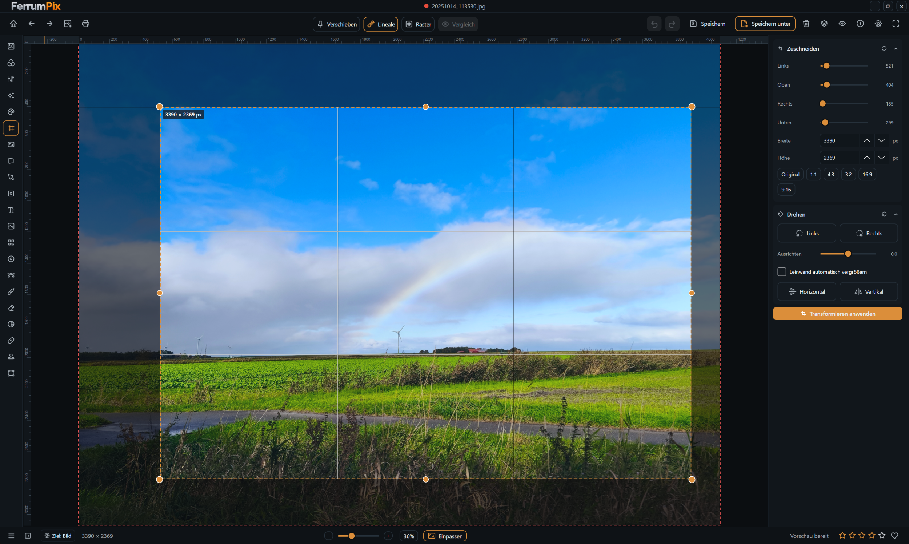
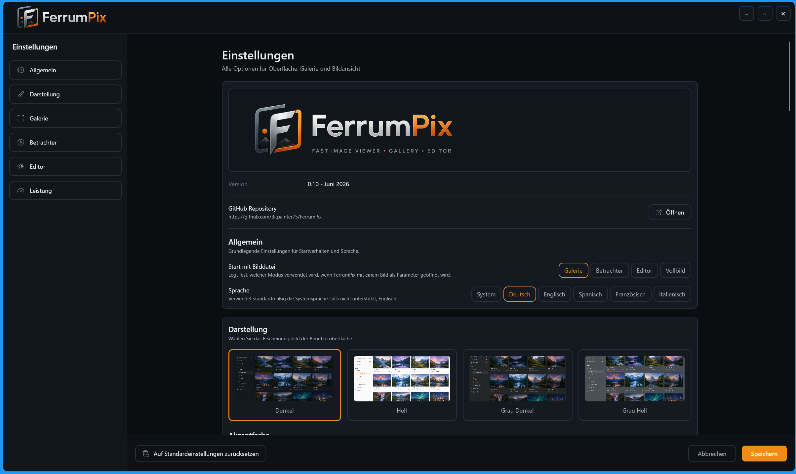

# FerrumPix

FerrumPix is a desktop photo manager and image editor for Linux and Windows, with experimental ARM64 and macOS builds. Browse your folders, sort and rate what is in them, look at photos properly, and edit them - all in one application, all on your own machine. It can also connect to a self-hosted [Immich](https://immich.app/) server.

It is built with [Avalonia UI](https://avaloniaui.net/) and .NET 10, in VB.NET, which I still love even though it is rare nowadays. This started as a private project - an application built exactly the way I always wanted one to look and work - and it is free and open source for anyone who finds it useful.

To be transparent: yes, I use AI to support my development workflow. However, anyone who actually codes knows that AI cannot build a complete, production-ready application on its own. It still requires a massive amount of manual work, architecture planning, and debugging. I am currently investing a lot of time, a ton of passion, unique ideas, and genuine hard work went into this project.

FerrumPix is in active development. The gallery, viewer, editor, settings and Immich integration are already usable. Current work focuses on stability, performance, workflow polish and cleanup.

Project website: [FerrumPix.app](https://ferrumpix.app/)

## What you can do with it

- Browse local photo folders with fast thumbnails, ratings, favourites, keywords and saved searches.
- View photos and videos fullscreen, compare two side by side, and check metadata and histogram.
- Edit: crop, resize, rotate and distort, exposure and colour, curves, filters, masks, retouching, text and shapes, layers.
- Develop RAW files from the sensor data, with lens correction from measured data for some 1300 lenses.
- Run batch work over a whole selection: rename, convert, resize, watermark, filters, metadata, export.
- Open JPEG, PNG, WEBP, BMP, GIF and RAW, plus HEIC/HEIF/AVIF, TIFF and Photoshop files read-only.
- Find the people in your photos and search by them, and search by where a photo was taken - both entirely on your own machine.
- Connect to your own Immich server for browsing, upload, download, editing and metadata sync.

Your originals are never changed behind your back: edits to RAW and Photoshop files live in a small sidecar next to the file, and everything else is only written when you save.

## Gallery


Folder tree, grid and list view, fast thumbnails, file operations, ratings, favourites, keywords and saved searches. Search combines plain text with metadata such as camera, ISO, aperture, focal length, date taken and image size.

Ratings, colour labels and keywords are read from XMP sidecars written by Lightroom, darktable or digiKam, so a collection you tagged elsewhere arrives with its work intact. Only empty fields are filled and keywords are merged.

An info panel shows the selected picture with its shot data, histogram, rating, label and keywords, and with several selected it shows what they have in common - a rating or a keyword set there applies to all of them. A keyword click lists every picture carrying it, and a button next to the filter holds all keywords in use with their counts, several selectable at once.

With people switched on, a second button next to it does the same for the people in your photos, and starts the search for a folder from inside that menu. Photos of the same person end up in one group; you give the group its name in the info panel, where every face on the picture is listed with its own crop. Where the recognition put a face with the wrong person, one button next to it takes that face back out, and only that photo changes. Detecting again goes over every photo, so an improved recognition reaches older ones too - but anything you set by hand stays untouched. With places switched on, a third button lists every place a photo was taken. The three buttons narrow each other down: a person, at a place, with a keyword is one question with three parts. A middle click on any filter or sort button puts it back to its default.

Person and place are also shown in the info panel of the viewer and the editor, so a picture on screen says who is on it and where it was taken.

For the bigger clean-up there is a people area of its own, reached by a button in the gallery above the settings one: a wall of faces, one per group, and opening a group shows every face in it - the place to sort out a library that grew over years. Point at a face and an eye appears that shows the whole photo it came from, because a small crop tells you who is in the picture but never which picture it was.

Batch work runs from the context menu or the footer menu: rename, convert, resize, watermark, filters, metadata removal - and *Export to*, which puts all of it into one dialog with a name pattern, a look, a size, a watermark and a target format, locally or straight to Immich. `.fpx` projects are one of the targets, so a batch can come out as files you can keep editing.

Photos can also be printed, laid out as contact sheets, or combined into a collage - each of them showing your edits, not the untouched file on disk.

## Viewer


Fullscreen viewing with zoom, pan, slideshow, filmstrip navigation, rating, tagging and deleting, and an info panel with EXIF, IPTC, XMP, ICC and a live histogram. Videos play inline.

Two photos can be put side by side: pick two in the gallery and choose *Compare*, or pin the one you are looking at. One zoom applies to both halves and dragging one moves the other, so you always see the same part of both pictures; for shots that are not framed alike, that link can be switched off. With a photo pinned, the filmstrip and the arrow keys page the other side onward against your fixed reference, and the button between the halves - or the space bar - swaps them. Each half carries its own stars, favourite and delete, so a series can be culled in one pass. RAW files are developed here rather than shown as the camera's embedded preview.

## Editor


**Geometry.** Crop, resize, rotate, flip and canvas size, plus three ways to distort: *Perspective* for converging verticals - four sliders, or drag the four corners in the photo; *Line warp*, where you lay a line on an edge and drag it where the edge should go; and *Grid warp* for everything a tilt cannot do. The picture follows while you drag. With an object selected, all three distort that object instead of the picture, and a distorted text can still be typed in afterwards.



**Light and colour.** Exposure, contrast, highlights, shadows, black and white point, white balance, tone curves, HSL, vibrance and saturation, colour grading with four colour wheels, and camera calibration. *Auto* measures the photo and sets a sensible starting point that you can then change. Slider settings can be saved under a name and put on any other photo, which is the usual way to develop a series consistently.

**Details and effects.** Clarity, structure, dust and scratches, sharpening and softening, and three kinds of noise reduction - the third one for the large colour blotches a pushed exposure leaves behind. *Depth blur* takes the blur strength from each point's distance instead of one radius for everything, so lights in the background open into bright discs with the shape of an aperture. Vignette, grain and frame sit in a separate *Effects* tool.

**Masks and selections.** Rectangle, ellipse, lasso and magic wand selections; a mask brush with a soft edge; graduated and radial masks you drag onto the picture and can keep adjusting afterwards. Any of them becomes a correction layer whose adjustment applies only inside it.

**With a model file installed** (see below), four more things become available: clicking an object to select it, selecting by distance from the camera, removing something from the picture so that the background is continued through the gap, and denoising a photo with a model - a separate step next to the noise sliders that takes minutes rather than seconds, with a strength slider for how much of the brightness it should touch.

**Retouching and painting.** Brush, eraser, blur and smudge, clone stamp and repair brush, with thirteen brush variants.

**Objects and layers.** Text, shapes, symbols, images, QR codes and watermarks, each with opacity, blend mode, shadow, glow and transform. The layers panel holds the whole stack with visibility, reorder, rename, grouping and rasterizing.


**Filters and presets.** Filters, LUT files (`.cube`) and XMP presets as written by Lightroom and Camera Raw.

**Saving.** Save as JPEG, PNG, WEBP, TIFF or PDF, or as an `.fpx` project that keeps adjustments and layers editable when you open it again. `Ctrl+P` prints what you see, edits included.

### RAW and other formats

RAW files are developed from the actual sensor data, under a fixed film-like base curve rather than being stretched until the brightest parts are nearly white - so a photo keeps the exposure it was taken with, and colours land close to what other raw developers show. Coloured speckle is cleaned up before the colour information is reconstructed, where it is still possible to tell it apart from detail.

Lens defects are corrected from measured data: distortion, the coloured fringes in the corners and the darkening towards the edges. FerrumPix brings an open collection covering some 1300 lenses and recognises lens and camera from the shot data. If there is no data for your lens, nothing is changed - a wrong lens curve is more visible than a missing one. It can be adjusted or switched off per photo.

Edits to a RAW go into a small `.fpxmp` sidecar next to it; the RAW itself is never modified, and the sidecar travels with the file when you move, copy or rename it in FerrumPix. A Lightroom `.xmp` sidecar with develop settings is converted once, so a photo edited elsewhere opens the way you left it.

Photoshop (`.psd`/`.psb`), HEIC/HEIF/AVIF and TIFF open read-only - *Save as…* writes them out in one of the normal formats. HEIC needs the system's `libheif`, except on macOS, which reads it itself; TIFF needs nothing extra.

### Model files

Six features use an extra file: selecting an object by clicking it, working by distance (the depth mask and the depth blur), removing an object, denoising a photo with a model, finding the people in your photos, and turning coordinates into a place name. They are not part of the package. The settings have a *Models* section that says how big each file is, fetches it when you press the button, and checks afterwards that what arrived is what was meant. Nothing is fetched unless you press it, and where a file is missing, the matching controls are simply not there.

Finding people and naming places have to be switched on there as well, on top of fetching the file. A face is a different matter from a keyword, and where a photo was taken is one too - so neither happens unless you say so. Place names come from a table on your own machine; nothing is looked up anywhere, and there is no map view.

The same section has a switch for the graphics card. It is off to begin with; turned on, denoising, click-to-select and the depth map run on the card instead of the processor and finish several times sooner, with the same result. FerrumPix names the card it found, will try it out when you ask, and lets you pick if the machine has more than one. Whatever the card cannot take - or will not do faster - keeps running on the processor, and if the card fails outright nothing is lost but time.

Everything runs on your own machine - nothing is sent anywhere. The files come from [MobileSAM](https://github.com/ChaoningZhang/MobileSAM) (Apache-2.0), [MiDaS](https://github.com/isl-org/MiDaS) (MIT), [LaMa](https://github.com/advimman/lama) (Apache-2.0), [SCUNet](https://github.com/cszn/SCUNet) (Apache-2.0), [NAFNet](https://github.com/megvii-research/NAFNet) (MIT), the [OpenCV Model Zoo](https://github.com/opencv/opencv_zoo) (MIT and Apache-2.0), the [ONNX Model Zoo](https://github.com/onnx/models) (Apache-2.0) and [GeoNames](https://www.geonames.org/) (CC BY 4.0), collected with their licences at [FerrumPix-Models](https://github.com/Bitpainter75/FerrumPix-Models).

## Immich

FerrumPix can connect directly to a self-hosted Immich server: browse all photos and albums, upload local files, download originals, sync ratings, favourites and keywords, search from saved search lists, and edit an Immich photo and save the result as a new asset. Updating or deleting existing assets is possible too, but has to be enabled in Settings.

FerrumPix authenticates with an API key. A key with `all` works; if you prefer a restricted one, build it up in layers - each missing permission disables exactly one function instead of breaking the integration:

**Read-only** - browse, view, download:

```
user.read  asset.read  asset.view  asset.download  album.read  person.read  tag.read
```

**Add for writing metadata** - ratings, favourites, description, keywords:

```
asset.update  tag.create  tag.asset
```

**Add for uploading** - upload from the gallery, and saving an edited photo as a new asset:

```
asset.upload  albumAsset.create  asset.copy
```

Plus `album.create` and `album.update` if FerrumPix should create and rename albums, and `asset.delete` with `album.delete` if *Allow deleting* is on.

One option needs a word of warning: *Update existing assets* replaces the file of an existing asset. The permission guarding that endpoint has changed names across Immich versions, so if saving fails with HTTP 403, look for the entry covering asset replacement in your version's API key dialog - or leave the option off, in which case FerrumPix always creates a new asset.

## Settings



Theme, accent colour, language, interface and font scale, thumbnail and export quality, metadata handling, video support, cache cleanup and the Immich connection.

The gallery has a few of its own: whether a double-click opens a photo in the viewer or in the editor, whether the info panel starts open, and whether file work follows a folder that is only a link to somewhere else, such as a second hard disk. Looking at and editing those photos is never restricted.

The editor can be set up to match how you work: which tool it opens with, the order of the groups in the tool bar, a default target format for saving and exporting, and how a photo is fitted into the editing area. Twenty-four adjustment groups can be hidden if you never use them - that only changes the display, your values are kept.

Two switches concern RAW development: adapting the base brightness to the camera model using reference values for over 200 models (off by default), and whether the lens correction is on for new photos (on by default - it does nothing unless there is data for your lens).

The last two sections are reference: a full list of keyboard and mouse shortcuts, and a *Technology* section listing everything FerrumPix is built on with a link to each licence.

## Installation

- Linux: AppImage, Flatpak, `.deb`, `.rpm`, portable ZIP, and [ferrumpix-bin](https://aur.archlinux.org/packages/ferrumpix-bin) in the AUR
- Windows: Setup or portable ZIP
- Experimental and untested, feedback welcome: ARM64 and macOS

The packages are self-contained and include the .NET runtime.

On macOS the window carries the usual title bar with the red, yellow and green buttons, and the shortcuts take Command where a Mac user reaches for it, while the combinations the system has claimed for itself are left alone. The builds are unsigned, so macOS may refuse to open the app at first.

`libmpv` (video) and `libraw` (RAW development) are required rather than optional. The Linux packages declare both as dependencies; the Windows releases bundle them. The Flatpak builds LibRaw in but ships no `libmpv`, so it has no video support, and the macOS builds need `brew install libraw`. Where a library is present on the system, FerrumPix prefers it over a bundled copy, so it keeps getting updates and support for newer cameras.

`libheif` is optional and never bundled, on any platform: it opens HEIC/HEIF/AVIF, and those are usually HEVC-encoded, which carries patent licensing in several countries - a decision for your distribution rather than for this project. Without it, HEIC files simply stay closed and everything else works. macOS is the exception: it reads these formats itself, so nothing has to be installed there.

## Building from source

Requires the [.NET SDK 10](https://dotnet.microsoft.com/) or newer.

```bash
dotnet build FerrumPix.sln
dotnet run --project FerrumPix.vbproj
```

## Licence

FerrumPix is [GPL-3.0-only](LICENSE). Every package carries that licence text and a `THIRD-PARTY-NOTICES.txt` naming each component and the licence it is used under: Avalonia UI, .NET, ReactiveUI, SkiaSharp, Svg.Skia, Microsoft.Data.Sqlite with SQLitePCLRaw, MetadataExtractor, QRCoder, BitMiracle.LibTiff.NET and ONNX Runtime (MIT, Apache-2.0 or BSD-3-Clause), the [Lensfun](https://github.com/lensfun/lensfun) lens database (CC-BY-SA 3.0), [Tabler Icons](https://github.com/tabler/tabler-icons) (MIT), and the bundled [LibRaw](https://www.libraw.org/) (LGPL-2.1), [libmpv](https://mpv.io/) (GPL-2.0-or-later) and optional [libheif](https://github.com/strukturag/libheif) (LGPL-3.0). For the GPL and LGPL libraries the packages also name the matching source: version, commit and build recipe.
